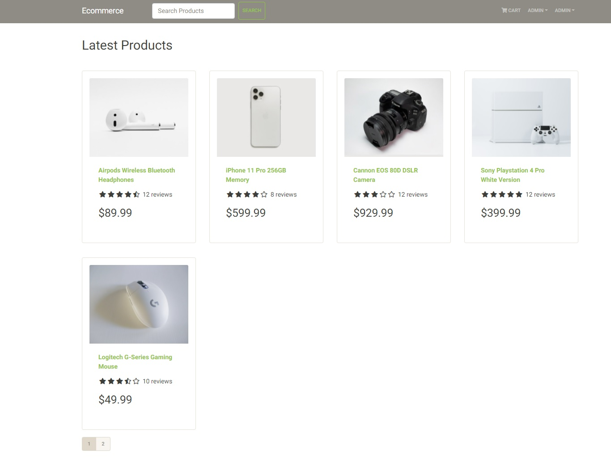

# ecommerce
Ecommerce app built on the MERN stack with all of the features you'd expect: user registration and authentication, ability to look at products and add to cart, 
ability to submit an order and pay for it through the PayPal API, add and delete products as an admin, user profile updates, searching, pagination and more.

## [Live Demo](https://mackcommerce.herokuapp.com/)


## Setup

1. Clone
```
git clone https://github.com/hmaiermack/ecommerce.git
```
2. Create .env file in the project root with the following:
```
NODE_ENV = development
PORT = 5000
MONGO_URI = your mongodb uri
JWT_SECRET = 'abc123'
PAYPAL_CLIENT_ID = your paypal client id
```
3. Install dependencies
```
npm install
cd frontend
npm install
```
4. Seed database
```
# Import data
npm run data:import
# Destroy data
npm run data:destroy
```
5. Run client and server from root
```
npm run server
npm run client
```

```
#Sample accounts

Admin
admin@example.com
password

Customer
mack@example.com
password
```
